# Analytics Event Tracker Component
## Documentation

The Analytics API automatically sends events to the Unity Analytics Service under certain circumstances (e.g., when a player begins a new session). Additionally, you can send analytics events to track player behavior at important moments. You can send these events either in code or using the Analytics Event Tracker.

Broadly speaking, the Tracker sends two types of events: Standard Events and Custom Events.

Note that events sent via the Tracker are subject to the same [data limits](https://docs.unity3d.com/Manual/UnityAnalyticsCustomEventsSDK.html) as other analytics events.

# Types of events

## Standard Events

Standard Events are a list of predefined events broadly useful for understanding player behavior as it relates to onboarding, progression, engagement, monetization, and general application use. Standard Events have fixed names and some number of required and/or optional parameters. You can add extra parameters to an event within the specified data limits. For more detail on specific Standard Events, refer to the Standard Events package documentation.

## Custom Events

In addition to Standard Events, developers can send arbitrary events of their own choosing. These events can have any name and any number of parameters within the specified data limits.

## Standard or Custom?

Use Standard Events to log baseline user behavior (e.g., tutorial completion, level progression). Because future tooling will leverage the Standard Event definitions, only use Custom Events when you require game-specific logging not already defined within the Standard Events framework.

# The Tracker at a glance

In essence, the Tracker has two parts: *trigger* and *payload*. When the terms of the trigger are met, the payload is sent as an Analytics event. Closing the foldouts clarifies this:

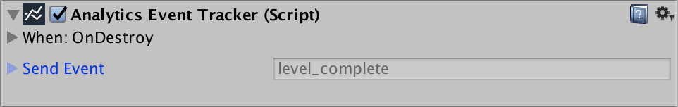

In the example above, when Unity dispatches the OnDestroy message to the GameObject, the Analytics Event Tracker component sends the level_complete payload.

The Tracker provides a lot of flexibility to define the specifics of both trigger and payload.

# Triggers

The Analytics Event Tracker defines three types of triggers: __Lifecycle__, __UI__, and __Timer__. You can also define additional rules to limit when a trigger fires.

## Lifecycle trigger

A lifecycle trigger will send the payload based on any of several events that occur in the [MonoBehaviour lifecycle](https://docs.unity3d.com/Manual/ExecutionOrder.html).

| Property| Function |
|:---|:---| 
| Lifecycle Event| The Monobehaviour lifecycle event that will trigger the payload. |

The following events can act as trigger:

* Awake

* Start

* OnEnable

* OnDisable

* OnApplicationPause

* OnApplicationUnpause

* OnDestroy

Noticeably missing from this list is Update. Unity Analytics is not designed for sending events at high frequency. Update would therefore be a poor choice. If you need to send an event at regular intervals, consider using a [Timer trigger](#bookmark=id.rpjt7lkah3qq).

## UI trigger

Triggering an event through a UI element such as a button is easy. Start by creating the button you want to instrument. 

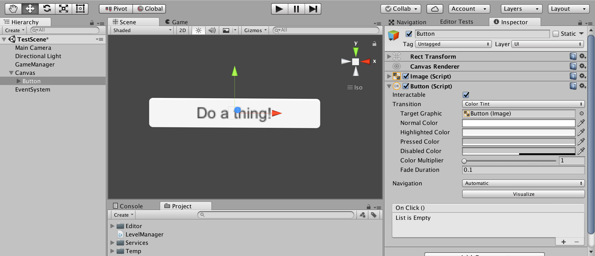

Next, create your Tracker. For simplicity, we've placed the Tracker on the same GameObject, but that is not required. Set the Tracker's trigger to UI.

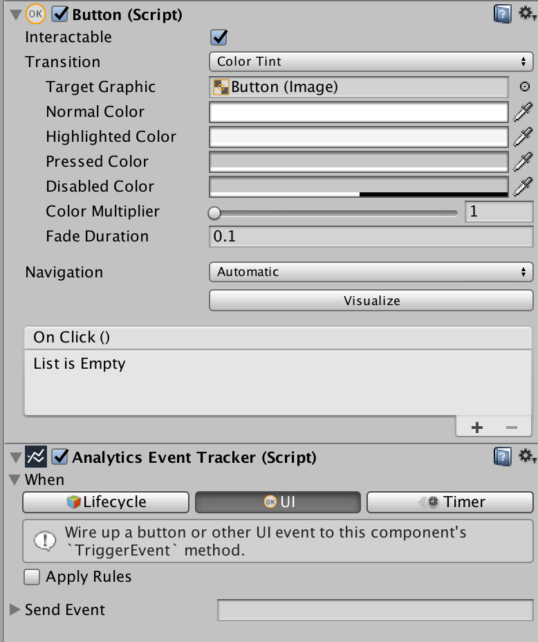

Finally wire the button's "On Click" Function to the "TriggerEvent" method of the Analytics Event Tracker.

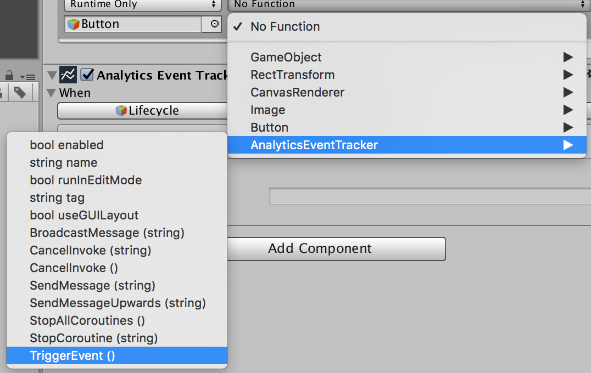

Now when this button is clicked, it will trigger the sending of the Tracker's payload.

## Timer trigger

A timer checks whether an event should be sent on a regular, timed basis. While an event can be set up to always send an event every X seconds, this trigger is mostly applied in conjunction with [rules](#bookmark=id.8jvmbn6wpt0u) to test – on a regular basis – whether an event *should* be triggered.

| Property| Function |
|:---|:---| 
| Initial Time| Time in seconds before the first test of the trigger. |
| Poll Time| Frequency in seconds after the initial trigger to repeatedly test the trigger. |

## Applying rules

Checking the 'Apply Rules' box from any trigger type will activate the rules section in the Inspector window:

Rules can be used in conjunction with any trigger type to constrain the trigger. For example, if the trigger type is Lifecycle: On Destroy, and the GameObject is destroyed, the Tracker will send the payload *only* if the terms of the added rules are met.

| Property| Function |
|:---|:---| 
| Repetitions| An int specifying how many times this event can be sent. 0 (default) indicates that the event can be sent indefinitely. 1 indicates the event can be sent only once. Note that the counter persists within the lifetime of the GameObject.  |
| Match| A boolean determiner for rule matching. The options are "All" (default) requiring that all rules be matched, "Any" requiring that any one rule be matched, and "None" meaning the payload will be triggered only if none of the rules are true. |
| Rules| A list of rules that must resolve to true or false. |

### Rule list

Each rule in the rule list will resolve to either true or false, contributing to the logic of whether the trigger will or will not be fired.

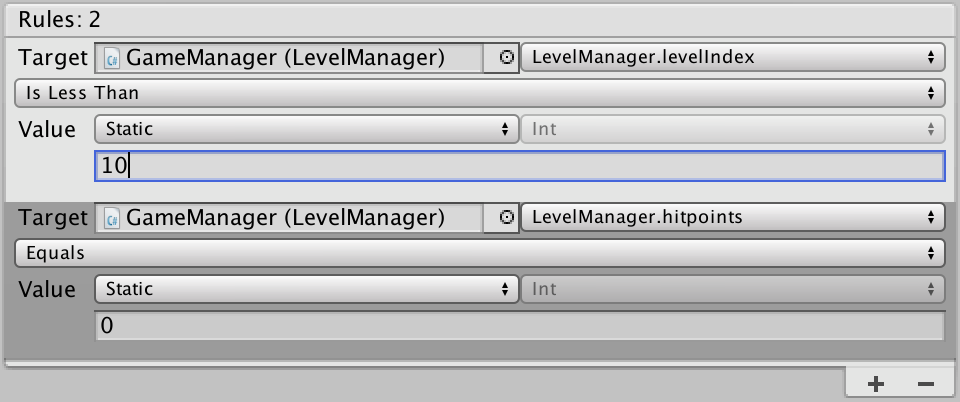

#### Adding a rule

To add a rule, click the plus button (+) at the bottom of the rule list.

#### Deleting a rule

To delete a rule, click the minus button (–) at the bottom of the rule list. To delete a specific rule, click the rule to select it, then click the minus button.

#### Rule summary

The number at the top of the control indicates the total number of rules in the list.

### Individual rules

Each rule is like an equation that resolves to either true or false. The target represents the left side of the equation, while the value is the right side.

As an equation, this may be visualized like so:

| Target (left side)| operator | Value (right side) | result |
|:---|:---|:---|:---| 
| 20| Is Greater Than | 10 | false |
| "some_string"| Equals | "some_string | true |
| false| Does Not Equal | true | true |

| Property| Function |
|:---|:---| 
| Target| The GameObject and property used as the left side of the equation. Most properties accessible to the Unity editor can be used, though some operators are limited by target type. |
| Operator| A mathematical operator to use for the comparison. Numerical target types (e.g., int and float) can be used to test a range of operators. Other target types (e.g., string, bool, and Enum) can only test against equality. |
| Value| The value to compare the target to. The value can be "static" (defined at authoring time) or "dynamic" (set to test against another GameObject and property). |

#### Setting a target

Use the same mechanism as when wiring a UI button to a Function: drag the relevant GameObject to the Target's GameObject field. Then navigate the Field drop-down menu until you find the field you want to track.

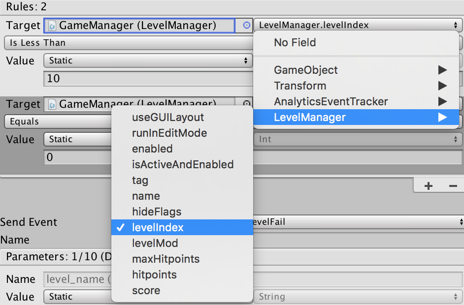

#### Picking an operator

By default the target compares equality. But this is just one of the available options. The complete list of operators is:

* Equals (target == value)

* Does Not Equal (target != value)

* Is Greater Than (target > value)

* Is Greater Than Or Equal To (target >= value)

* Is Less Than (target < value)

* Is Less Than Or Equal To (target <= value)

* Is Between (value > target && target < value2)

* Is Between Or Equal To (value >= target && target <= value2)

Note that for most object types, Equals and Does Not Equal are the only permitted operators. The remaining operators are reserved for numerical types, such as float and int.

Also, note that in the case of "Is Between" and "Is Between Or Equal To", a secondary value field will appear, allowing the developer to set the extents of the test.

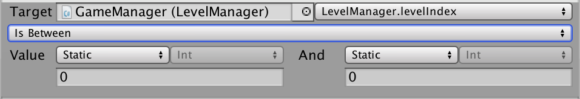

#### Picking a value

Values may be either "static" or "dynamic". Static values are entered explicitly into a field at author-time, according to the target's type. For example, if the type in question is a bool, a True/False pulldown will indicate whether the matching value is true or false. If the target type is a float, a float field will be presented instead.

Dynamic values are like a second target. Drop the GameObject into the Value GameObject field and then select a field. The drop-down menu will be trimmed to properties whose type match the target type.

# Payload

The payload is the actual content to be sent to the Analytics Service. This can be either a Standard Event or a Custom Event.

## Sending a Standard Event

Access Standard Events in the Tracker via the Event drop-down menu:

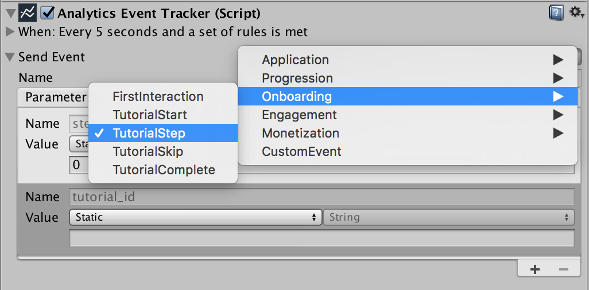

See the complete list of Standard Events in the Standard Event [documentation](https://docs.google.com/document/d/1oY_4CuGCnUZ6vWTreI1cdrrZRFy-7I6YYY43zKSfyXQ/edit#).

Once you select a Standard Event, it's name appears in the payload __Name__ field. The name is not editable (a Standard Event with a different name wouldn't be very standard). It is merely provided to confirm that you have selected the correct event and to show the name that will be displayed in the Analytics dashboard.

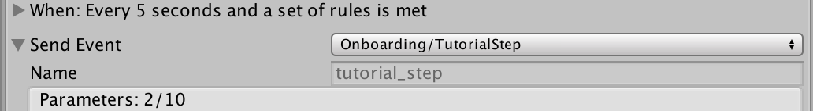

Note that by convention all event names are in lower_snake_case.

In addition to the name, the Tracker displays all the required and optional parameters for the event in the parameter list. The Tracker is designed to show warnings if any required parameters are not properly filled in.

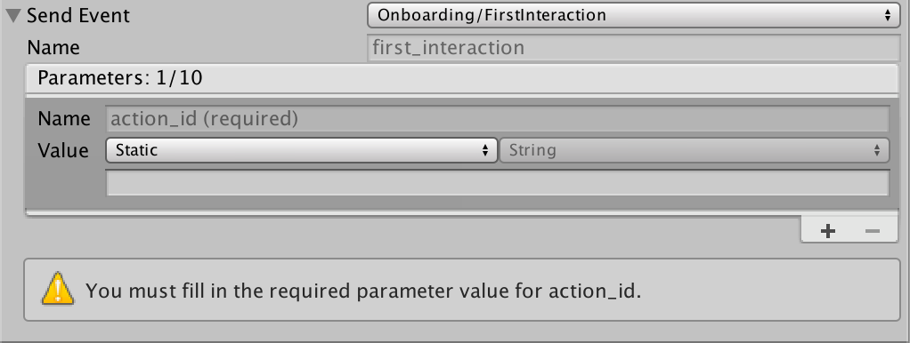

For the same reason that you cannot edit the __Name__ field of a Standard Event, you cannot edit the required or optional parameter names and types.

You cannot remove either required or optional parameters from the parameter list, but you can disable optional parameters so that they are not sent to the Analytics service and do not count against the 10 parameter limit. The number of disabled parameters is summarized at the top of the list.

The Tracker can send up to 10 parameters for an event. This includes all required parameters, any enabled optional parameters, and any additional custom parameters that you define. The summary at the top maintains a count of the parameters in use; the list may never exceed 10 items.

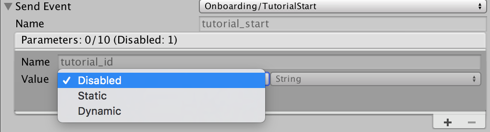

### Parameter Values

Parameter values may be either static or dynamic. This is exactly the same mechanism described in the rules system above. Static values are determined at author-time. Dynamic values are determined by wiring the value to a GameObject and field. Picking a value "type" specifies what type of data to send. A dynamic value specified the type in accordance with the type of the field selected.

## Sending a Custom Event

If you can't find the event you need among the list of Standard Events, select "CustomEvent" from the event pulldown.

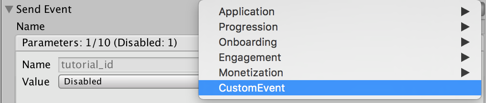

Custom Events behave exactly like Standard Events with the following differences.

1. The event's __Name__ field is editable. You *must* enter a name for the event.

2. There are no required or optional parameters. All parameters are entirely custom.

